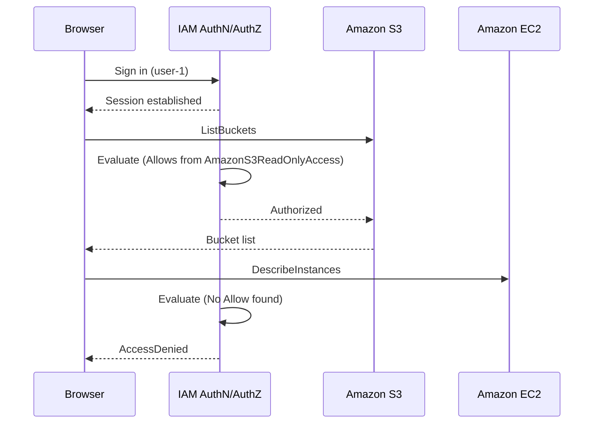
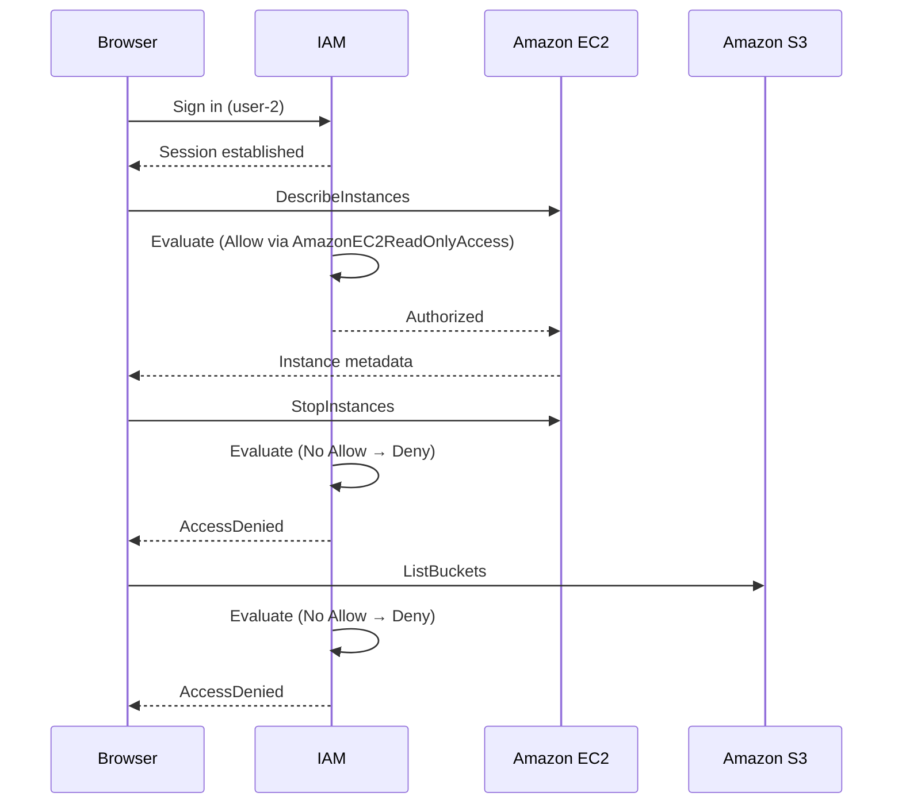
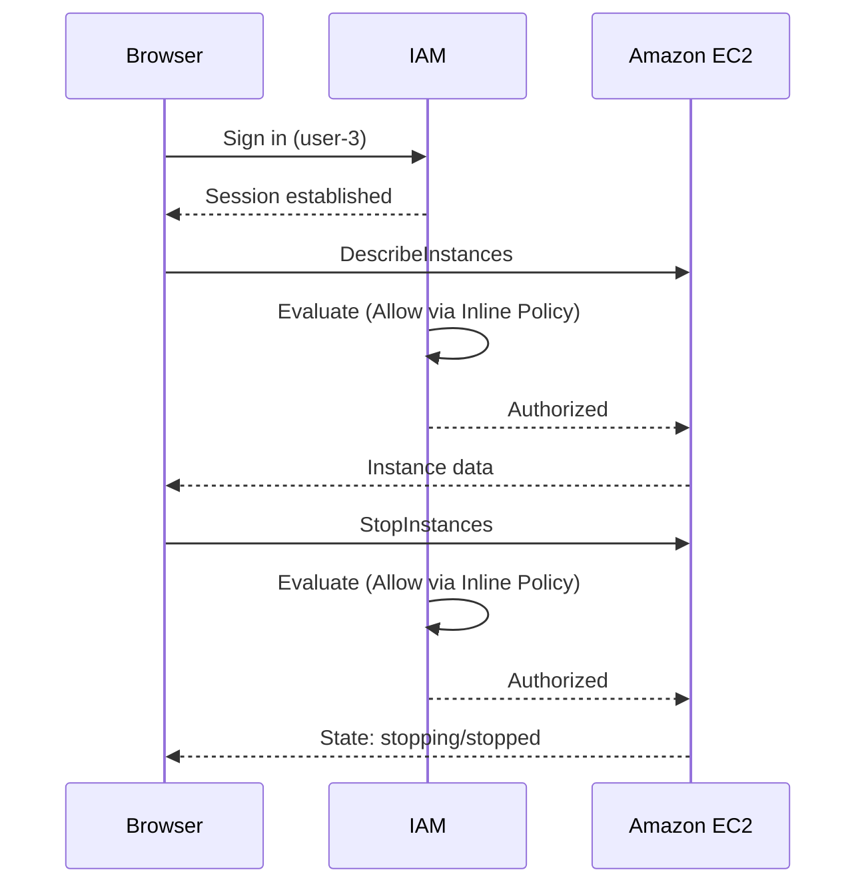

## Lab 1 – Introduction to AWS IAM

## Architectural Diagram
```
+----------------------------- AWS IAM Architecture ------------------------------+
| Users: user-1 | user-2 | user-3                                                |
|                                                                                 |
| Groups & Policies:                                                              |
|   [S3-Support] --> (AWS Managed) AmazonS3ReadOnlyAccess --> Allows: S3 Read     |
|   [EC2-Support] -> (AWS Managed) AmazonEC2ReadOnlyAccess -> Allows: EC2 Describe|
|   [EC2-Admin] --> (Inline Policy) Describe + Start/Stop EC2                     |
|                                                                                 |
| Group Membership After Assignment:                                              |
|   user-1 -> S3-Support                                                          |
|   user-2 -> EC2-Support                                                         |
|   user-3 -> EC2-Admin                                                           |
|                                                                                 |
| Console Session Flow:                                                           |
|   Browser Sign-In URL --> IAM AuthN --> Session Token --> Policy Aggregation -->|
|   Policy Evaluation (Allow overrides implicit deny) --> Service API Call        |
|                                                                                 |
| Test Outcomes:                                                                  |
|   user-1: S3 list OK | EC2 denied                                               |
|   user-2: EC2 describe OK | EC2 stop denied | S3 denied                         |
|   user-3: EC2 describe + stop OK                                                |
+---------------------------------------------------------------------------------+
```

## Objective
Investigate pre-created IAM users and groups, analyze attached policies, implement a role-based access strategy by assigning users to groups, and validate effective permissions through console session testing.

## Background
AWS Identity and Access Management (IAM) enables centralized control of authentication (who signs in) and authorization (what they can do). Core components:

- Users: Long-lived identities (people/apps) with credentials.
- Groups: Collections of users that inherit shared permissions.
- Policies: JSON documents defining allowed/denied Actions on Resources (optionally under Conditions).
  - AWS Managed or Customer Managed (reusable).
  - Inline (embedded into a single user/group—one-off).
- Roles (conceptual only in this lab): Assumable identities for temporary credentials and federation.

Policy statement elements:
- Effect: Allow | Deny
- Action: API operations (e.g., `ec2:DescribeInstances`, `s3:ListBucket`)
- Resource: Specific ARNs or `*`
- (Optional) Condition: Context-based constraints

Security principle applied: Least Privilege.

---

## Pre-Lab Environment Summary

### Users
- user-1
- user-2
- user-3

### Groups and Initial Policies
| Group        | Policy Type  | Attached Policy                | Capability Summary                                |
|--------------|--------------|--------------------------------|---------------------------------------------------|
| EC2-Support  | AWS Managed  | AmazonEC2ReadOnlyAccess        | Read/list/describe EC2, ELB, CloudWatch, AutoScaling |
| S3-Support   | AWS Managed  | AmazonS3ReadOnlyAccess         | List/Get S3 buckets and objects (read-only)       |
| EC2-Admin    | Inline       | Custom inline policy           | Describe + Start/Stop EC2 instances               |

Initially, no users belong to any group.

---

## Business Scenario
Growth in AWS usage requires differentiated access:
| User    | Target Group | Required Permissions                                  |
|---------|--------------|-------------------------------------------------------|
| user-1  | S3-Support   | Read-only S3                                          |
| user-2  | EC2-Support  | Read-only EC2 (no state changes)                      |
| user-3  | EC2-Admin    | View + Start/Stop EC2 instances                       |

---

### Inspection Phase

1. Open the AWS Console and navigate: Services search → IAM.

2. In left navigation: Users → verify `user-1`, `user-2`, `user-3` listed.

          [Screenshot Placeholder 1: IAM Users List Showing Three Users – Full Screen]

3. Select `user-1` → Permissions tab (shows no permissions attached).

4. Switch to the Groups tab for `user-1` (shows no memberships).

5. Security credentials tab: Console password presence.

6. Navigate to User groups → list groups EC2-Admin, EC2-Support, S3-Support.

          [Screenshot Placeholder 2: User Groups List (Three Groups) – Full Screen]

7. Open EC2-Support group → Permissions tab → expand `AmazonEC2ReadOnlyAccess`.

8. Collapse policy.

9. Open S3-Support group → Permissions → expand `AmazonS3ReadOnlyAccess`.

10. Open EC2-Admin group → Permissions → expand Inline Policy.
    

### Assignment Phase (Adding Users to Groups)

1. Add `user-1` to S3-Support (Users tab → Add users → select user-1 → Add).

2. Add `user-2` to EC2-Support.

3. Add `user-3` to EC2-Admin.

4. Verify user counts (each group shows “1” in the users column).

            [Screenshot Placeholder 3: User Groups List Showing User Count = 1 for All – Full Screen]
   

### Validation Phase (Sign-In & Permission Testing)

Obtain the IAM sign-in URL from the IAM Dashboard.

Open a private/incognito browser session.


#### A. Test user-1 (S3 Support)

## Sequence Diagram: user-1 (S3 Read-Only)



**Sign in as:**
- IAM user name: user-1
- Password: Lab-Password1
          [Screenshot Placeholder 4: Successful user-1 Console Landing (Region Visible) – Full Screen]

Navigate to S3: confirm bucket list and empty contents.

Navigate to EC2 → Instances; expect authorization error.

        [Screenshot Placeholder 5: EC2 Console Authorization Error for user-1 – Full Screen]

Sign out.


#### B. Test user-2 (EC2 Support)

## Sequence Diagram: user-2 (EC2 Support)



**Sign in as:**
  - IAM user name: user-2
  - Password: Lab-Password2

            [Screenshot Placeholder 6: Successful user-2 Console Landing – Full Screen]

Navigate to EC2 → Instances: instance `LabHost` visible.

Attempt Stop instance → expect “not authorized”.

            [Screenshot Placeholder 7: Failed Stop Attempt (Access Denied Message) – Full Screen]

Navigate to S3: expect permission denial when listing buckets.

            [Screenshot Placeholder 8: S3 Access Denied Message for user-2 – Full Screen]

Sign out.


#### C. Test user-3 (EC2 Admin)

## Sequence Diagram: user-3 (EC2 Admin)



**Sign in as**
  - IAM user name - user-3
  - Password - Lab-Password3

              [Screenshot Placeholder 9: Successful user-3 Console Landing – Full Screen]

Navigate to EC2 → Instances: instance visible.

Stop instance (`LabHost`): issue Stop command confirmation dialog.

The instance enters the stopping state.

              [Screenshot Placeholder 10: Instance State = stopping / stopped – Full Screen]

Close private session.

---

## Observations
| User Tested | Service & Action | Observation | Expected? |
|-------------|------------------|------------|-----------|
| user-1 | S3 list/view | Bucket visible; read only | Yes |
| user-1 | EC2 list | Access denied | Yes |
| user-2 | EC2 view | Instance visible | Yes |
| user-2 | EC2 stop | Access denied | Yes |
| user-2 | S3 list | Access denied | Yes |
| user-3 | EC2 stop | Action succeeded | Yes |

Regional mismatch can cause “no instances” confusion; verify the top-right region (e.g., N. Virginia / us-east-1).

---
## Security & Compliance
- Principle of Least Privilege upheld.
- No excess write powers granted to support roles.
- Administrative actions limited (no termination or creation).
- Console-only access reduced exposure (no access keys issued in this lab).
  
---

## Results
- Users inherited permissions solely through their assigned groups.
- Managed policies delivered standardized read-only scopes.
- Inline policy granted narrowly-scoped operational control (Start/Stop) without broader admin privileges.
- Negative tests validated least privilege (denials triggered as designed).

---

## Discussion
This exercise reinforces:
- Separation of duties via discrete group assignments simplifies onboarding/offboarding.
- Managed vs inline policy trade-offs: reuse/versioning vs specificity.
- Testing must include attempted disallowed actions to confirm guardrails.
- Inline policies should be minimized in production; prefer customer-managed policies for maintainability.
---

## Conclusion
The lab achieved its objectives:
- Enumerated and inspected IAM users and groups.
- Distinguished managed vs inline policies.
- Implemented role-based group assignments aligned to a real scenario.
- Validated effective permissions through controlled logins and action attempts.
- Demonstrated least privilege enforcement and operational segregation.

This foundational pattern supports scalable access governance in broader AWS environments.

---

## 14. Appendix A: Example EC2 Admin Inline Policy (Representative)
```json
{
  "Version": "2012-10-17",
  "Statement": [
    {
      "Sid": "EC2ViewAndLifecycle",
      "Effect": "Allow",
      "Action": [
        "ec2:Describe*",
        "ec2:StartInstances",
        "ec2:StopInstances"
      ],
      "Resource": "*"
    }
  ]
}
```
---
