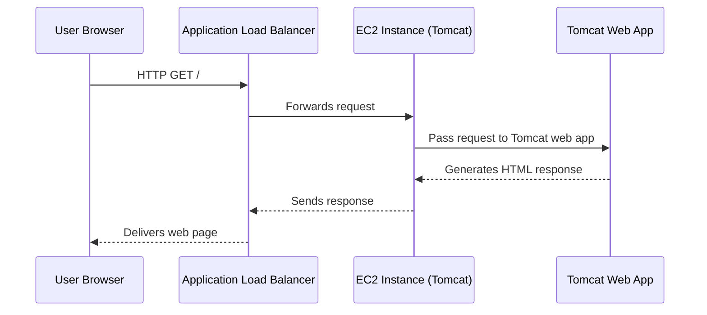

# Lab: Deploying a Web App with AWS Elastic Beanstalk

---

**Objectives:**
- Prepare and upload your application to S3
- Create and configure an Elastic Beanstalk environment (Tomcat platform)
- Launch and verify the web app
- Explore underlying AWS resources (EC2, ALB, Auto Scaling, Security Group, S3)
- Monitor and update the application
- Clean up all resources

---

## Prerequisites

- AWS account (IAM permissions for Elastic Beanstalk, EC2, S3)
- Region: **us-east-1 (N. Virginia)**
- Browser with pop-ups enabled

---

### Architectural Diagram:
```
+-------------------------------------------------------------+
|                        AWS Cloud                            |
|                                                             |
|  +-------------------+                                      |
|  |   Amazon S3       |  (App Versions)                      |
|  +-------------------+                                      |
|           |                                                 |
|           v                                                 |
|  +-----------------------------+                            |
|  |   Elastic Beanstalk Service |                            |
|  +-----------------------------+                            |
|           |                                                 |
|           v                                                 |
|  +-----------------------------+                            |
|  | Application Load Balancer   |                            |
|  +-----------------------------+                            |
|           |                                                 |
|           v                                                 |
|  +-----------------------------------------------+          |
|  |         Auto Scaling Group                    |          |
|  |   +----------+   +----------+   +----------+  |          |
|  |   |  EC2-1   |   |  EC2-2   |...|  EC2-n   |  |          |
|  |   | (Tomcat) |   | (Tomcat) |   | (Tomcat) |  |          |
|  |   +----------+   +----------+   +----------+  |          |
|  +-----------------------------------------------+          |
|                |                                            |
|         [IAM Role, Security Group]                          |
+-------------------------------------------------------------+

User Browser
   |
   v
[App URL: my-eb-env.elasticbeanstalk.com]
   |
   v
Application Load Balancer → Auto Scaled EC2s (Tomcat)
```
---

## 1. Prepare Your Application Package

1. **Download a sample Tomcat app:**
   - [tomcat.zip](https://docs.aws.amazon.com/elasticbeanstalk/latest/dg/samples/tomcat.zip)

---

## 2. Create an S3 Bucket (Optional)

Elastic Beanstalk can manage S3 storage automatically, but you may create a custom bucket for more control.

1. AWS Console → S3 → **Create bucket**
2. Name: `my-eb-apps-bucket`
3. (For testing only) Uncheck **Block Public Access** and acknowledge the warning.
4. Accept other defaults, create the bucket.
5. Click bucket name → **Upload** → **Add files** → select **tomcat.zip** → **Upload**

     

---

## 3. Create a New Elastic Beanstalk Application

1. AWS Console → **Elastic Beanstalk**
2. Click **Create environment**
3. Choose **Web server environment**
4. **Application name:** `my-elastic-beanstalk-app`
5. **Environment name:** `my-eb-env`
6. **Domain:** (auto-generated or customize, e.g. `techgeek68`)
7. **Platform:** Select `Tomcat` (latest version)
8. **Application code:**  
   - Choose "Upload your code"
   - **Version label:** V1.0
   - Choose **Local file** (upload `tomcat.zip`) or **Public S3 URL** (e.g., `s3://my-eb-apps-bucket/tomcat.zip`)
9. **Service access:**  
   - Service role: `LabRole`  
   - EC2 instance profile: `LabInstanceProfile`
10. **Instance settings:** (Optional, leave default or adjust as needed)
11. **Database:** None (leave default for this lab)
12. **Instance configuration:**
    - **Auto scaling group:** Load balanced
    - Min: 2, Max: 6 (default: 2)
    - **Instance type:** t2.micro or t2.small
    - **Load Balancer:** Application Load Balancer (default)
13. **Rolling updates, monitoring, logging:** (Leave default or adjust as needed)
14. **Create environment** to deploy

---

## 4. Launch and Monitor the Environment

- Click **Create environment**.
- Wait several minutes while AWS provisions all resources (EC2, ALB, Auto Scaling, Security Group, S3).
- Health status should display **Ok** on completion.

           
  
---

## 5. Test and Verify

1. In the environment dashboard, find **Domain** and click the **environment URL** (ends with `elasticbeanstalk.com`).
2. You should see the sample Tomcat application page.

              
---

## 6. Explore Underlying AWS Resources

- **EC2:** EC2 Dashboard → Instances. You will see two instances named after your environment.
  
                

- **Load Balancer:** EC2 → Load Balancers. An Application Load Balancer (ALB) front-ends your environment.

                
  
- **Auto Scaling Group:** EC2 → Auto Scaling Groups. Manages instance scaling.

               
  
- **Security Group:** Allows HTTP (port 80) from anywhere.
- **S3 Bucket:** Stores application version uploads.

---

## 7. Monitor and Manage

- Elastic Beanstalk → Environment → **Monitoring** tab for metrics (CPU, requests, etc)
- Use **Configuration** to adjust scaling, instance type, or environment variables.

---

## 8. Update Your Application - Optional

1. Make code changes locally.
2. Zip and upload a new version:
   - Beanstalk → Environment → **Upload and Deploy**

---

## 9. Clean Up - Optional

1. **Terminate environment:**  
   - Elastic Beanstalk → Actions → **Terminate environment** (removes all associated AWS resources)
2. **(Optional) Delete S3 buckets** if you created custom ones.

---

## Troubleshooting

| Symptom                    | Possible Cause                 | Solution                                  |
|----------------------------|-------------------------------|-------------------------------------------|
| 404/503 after deploy       | App deploy not complete        | Wait for health status "Ok"               |
| Cannot access app          | Security group/firewall issue  | Ensure port 80 is open in security group  |
| Deploy fails               | Incorrect zip format           | Zip app files properly, not a folder      |

---

## Sequence Diagram: Web Request Flow



---
