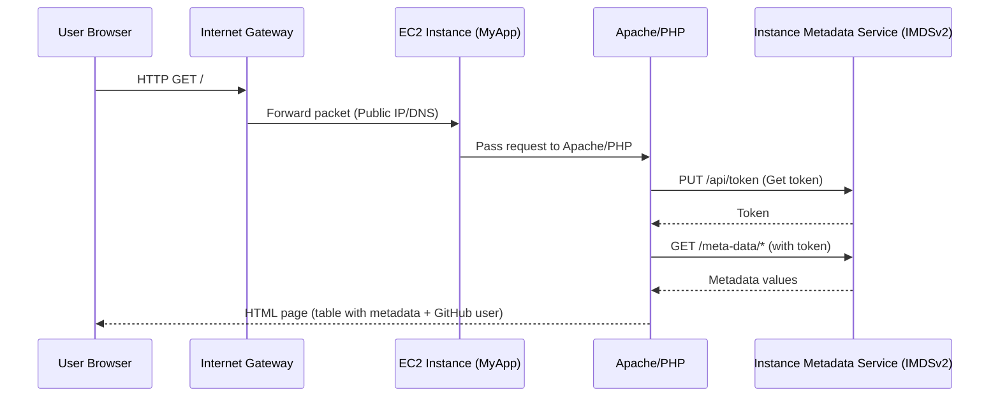

# Lab: Build a VPC (Virtual Private Cloud) and Launch a Web Server

An AWS VPC is a logically isolated section of the Amazon Web Services (AWS) cloud, where you can launch AWS resources within a virtual network that you define. It gives you control over your own virtual networking environment, similar to a traditional network in your own data center, but with the benefits of using AWS's scalable infrastructure. You can configure IP address ranges, create subnets, and set up routing and security to control access. 

---

**Objectives:**
- Create a VPC and subnets
- Configure networking components (route tables, IGW, NAT GW)
- Create and configure a security group
- Launch and verify a web server EC2 instance

---

## Architectural Diagram
```
                +---------------------+
                |      Internet       |
                +----------+----------+
                           |
                     0.0.0.0/0
                           |
                     +-----v-----+
                     |  IGW      |  <-- Internet Gateway (lab-igw)
                     +-----+-----+
                           |
         +-----------------+------------------+
         |                                    |
+--------v--------+                  +--------v--------+
| Public Subnet 1 |                  | Public Subnet 2 |
| 10.0.0.0/24     |                  | 10.0.2.0/24     |
| (us-east-1a)    |                  | (us-east-1b)    |
|                 |                  |   EC2: MyApp    |
| NAT Gateway     |                  |   (Apache/PHP)  |
| (lab-nat-gw)    |                  |   SG: Allow 80  |
+--------+--------+                  +--------+--------+
         |                                    |
         |                                    |
  (lab-public-rt: 0.0.0.0/0 → IGW)   (lab-public-rt: 0.0.0.0/0 → IGW)
         |                                    |
         +----------------+-------------------+
                          |
                +---------v---------+
                | Private Subnet 1  |
                | 10.0.1.0/24       |
                | (us-east-1a)      |
                +---------+---------+
                          |
                +---------v---------+
                | Private Subnet 2  |
                | 10.0.3.0/24       |
                | (us-east-1b)      |
                +---------+---------+

   (lab-private-rt: 0.0.0.0/0 → NAT Gateway in Public Subnet 1)

```

---

**1. Set Region**

1. Sign in to the AWS Console.
2. Region selector (top-right): choose “US East (N. Virginia)” (us-east-1).
3. Confirm the region indicator shows N. Virginia.


**2. Create the VPC**

1. Open the VPC service.
2. Left nav: “Your VPCs” → “Create VPC”.
3. Choose “VPC only”.
4. Name tag: `lab-vpc`
5. IPv4 CIDR block: `10.0.0.0/16`
6. IPv6: No IPv6 CIDR block.
7. Tenancy: Default.
8. Create VPC → View VPC to confirm.

---

**3. Create Subnets**
  - VPC Console → Subnets → Create subnet
  
**Public Subnet 1**
- VPC: `lab-vpc`
- Subnet name: `Public Subnet 1`
- Availability Zone: `us-east-1a`
- IPv4 Subnet CIDR: `10.0.0.0/24`
- Create
- Select it → Actions → Edit subnet settings → Enable “Auto-assign public IPv4” → Save.

**Private Subnet 1**
- VPC: `lab-vpc`
- Name: `Private Subnet 1`
- AZ: `us-east-1a`
- IPv4 Subnet CIDR: `10.0.1.0/24`
- Create (leave auto-assign public IPv4 disabled).

**Public Subnet 2**
- VPC: `lab-vpc`
- Name: `Public Subnet 2`
- AZ: `us-east-1b`
- IPv4 Subnet CIDR: `10.0.2.0/24`
- Create
- Select it → Actions → Edit subnet settings → Enable “Auto-assign public IPv4” → Save.

**Private Subnet 2**
- VPC: `lab-vpc`
- Name: `Private Subnet 2`
- AZ: `us-east-1b`
- IPv4 Subnet CIDR: `10.0.3.0/24`
- Create (auto-assign public IPv4 stays disabled).

---

**4. Internet Gateway**

1. Left nav: Internet gateways → Create internet gateway.
2. Name: `lab-igw` → Create.
3. Select `lab-igw` → Actions → Attach to VPC → choose `lab-vpc` → Attach.

---

**5. Elastic IPs (for NAT Gateway)**

1. Left nav: Elastic IP addresses → Allocate Elastic IP address.
2. Tag Name:`lab-nat-eip`; OK; → Allocate.

---

**6. NAT Gateway**

1. Name tag: `lab-nat-gw`
2. Left nav: NAT gateways → Create NAT gateway.
3. Subnet: `Public Subnet 1`
4. Connectivity type: Public.
5. Elastic IP allocation ID: Choose the allocated EIP.
6. Tags: Name
7. Create.
    
  - Wait until 'State=Available' before creating private routes.
  
---

**7. Public Route Table**

1. Route tables → Create a route table.
2. Name: `lab-public-rt` | VPC: `lab-vpc` → Create.
3. Select `lab-public-rt` → Routes tab → Edit routes → Add route:
   - Destination: `0.0.0.0/0`
   - Target: Internet Gateway - `lab-igw`
   → Save.
4. Subnet associations → Edit → Subnets without explicit associations → select `Public Subnet 1` and `Public Subnet 2` → Save.

---

**8. Private Route Table**

1. Create a route table.
2. Name: `lab-private-rt` | VPC: `lab-vpc` → Create.
3. Select it → Routes tab → Edit routes → Add:
   - Destination: `0.0.0.0/0`
   - Target: NAT Gateway (`lab-nat-gw`)
   → Save.
4. Subnet associations → Subnets without explicit associations → Edit → select `Private Subnet 1` and `Private Subnet 2` → Save.

---

- VPC Dashboard → Your VPCs → Select your VPC → Resource map


---

**9. Security Group**

1. Security groups → Create a security group.
2. Name: `Web Security Group`
3. Description: `Allow HTTP from anywhere`
4. VPC: `lab-vpc`
5. Inbound rule:
   - Type: HTTP
   - Source type: Anywhere-IPv4
6. Outbound: leave default (All traffic).
7. Create.

---

**10. Key Pair**

1. EC2 → Key pairs → Create key pair.
2. Name: `MyLoginKey`
3. Key pair type: RSA
4. Format: `.pem`               (unless you need `.ppk` for PuTTY).
5. Create & store securely.

---

**11. Launch EC2 Instance (Web Server 1 – RHEL)**

Note: If a “RHEL 10” AMI isn’t available, pick the latest RHEL 9 image. This script is compatible with both.

1. EC2 → Instances → Launch instances.
2. Name: `MyApp`
3. Application and OS Image: Search “Red Hat Enterprise Linux” → select the latest official RHEL (HVM, x86_64).
4. Instance type: `t2.micro`.
5. Key pair: `MyLoginKey`.
6. Network settings (Edit):
   - VPC: `lab-vpc`
   - Subnet: `Public Subnet 2 (us-east-1b)`
   - Auto-assign public IP: Enable
   - Firewall: Select existing security group → `Web Security Group`
7. Storage: Leave default (8–10 GiB gp3).
8. Advanced details → User data → paste the script below.
9. Launch instance → open Instance ID when the success banner appears.

**User Data Script**
The following script:
- Updates the system packages (dnf -y update).
- Installs httpd, PHP (php, php-mysqlnd), mariadb-server, curl, jq, firewalld, and SELinux utilities.
- Enables/starts firewalld and httpd (attempts to enable/start mariadb), opens HTTP (port 80) in the firewall.
- Enables Apache outbound networking (setsebool httpd_can_network_connect on), writes a PHP page at /var/www/html/index.php that fetches IMDSv2 metadata, sets permissions, and restarts httpd.
- Writes a completion log and warns that the PHP page exposes instance metadata.

```bash
#!/bin/bash
set -euo pipefail

sudo dnf -y update
# Optional: enable newer PHP stream
# sudo dnf module reset -y php
# sudo dnf module enable -y php:8.2

sudo dnf install -y httpd php php-mysqlnd mariadb-server curl jq firewalld policycoreutils-python-utils

# enable & start services
sudo systemctl enable --now firewalld httpd mariadb || true
sudo firewall-cmd --permanent --add-service=http
sudo firewall-cmd --reload

# SELinux: allow Apache outbound network
sudo setsebool -P httpd_can_network_connect on

# write a minimal PHP metadata page (IMDSv2)
sudo tee /var/www/html/index.php > /dev/null <<'PHP'
<?php
function md($p){
  $t = trim(shell_exec("curl -s -X PUT http://169.254.169.254/latest/api/token -H 'X-aws-ec2-metadata-token-ttl-seconds:60'"));
  if (!$t) return 'N/A';
  $v = trim(shell_exec("curl -s -H 'X-aws-ec2-metadata-token: $t' http://169.254.169.254/latest/meta-data/$p"));
  return $v ? htmlspecialchars($v) : 'N/A';
}
$meta = [
  'Instance ID'=>md('instance-id'),
  'Instance Type'=>md('instance-type'),
  'Availability Zone'=>md('placement/availability-zone'),
  'Private IP'=>md('local-ipv4'),
  'Public Hostname'=>md('public-hostname'),
  'Public IPv4'=>md('public-ipv4'),
];
?>
<!doctype html><html><head><meta charset="utf-8"><title>AWS Lab</title>
<style>body{font-family:Arial;margin:30px;background:#f5f7fa}.box{background:#fff;padding:12px;border-radius:6px}</style>
</head><body><h1>AWS Lab Web App</h1><div class="box"><h2>Instance Metadata</h2><table><?php foreach($meta as $k=>$v){echo "<tr><td>$k</td><td>$v</td></tr>";}?></table>
<p>GitHub Username: <strong>techgeek68</strong></p></div><footer style="margin-top:20px;font-size:12px">&copy; <?=date('Y')?> AWS Lab Demo</footer></body></html>
PHP

sudo chown apache:apache /var/www/html/index.php
sudo chmod 644 /var/www/html/index.php

echo "User data script complete" | sudo tee /var/log/user-data-status.txt
```

---

**12. Verify Instance**

1. Wait for Instance state: `running` and Status checks: `2/2`.
2. In “Details” pane: note Public IPv4 DNS and Public IPv4 address.

---

**13. Test Web App**
1. Browser → `http://<Public-DNS>` (or `http://<Public-IP>`).
2. You should see:


## Lab Finished

---

**Sequence Diagram: Web Request & Metadata Fetch**



**Complete Architecture**:


## Lab Finished!

---


**14. Cleanup (Teardown Order)**

1. Terminate the EC2 instance.
2. Delete NAT Gateway (wait until deleted).
3. Release Elastic IP.
4. Detach then delete Internet Gateway (`lab-igw`).
5. Delete subnets (must be empty).
6. Delete route tables (`lab-public-rt`, `lab-private-rt`) (not the main).
7. Delete security group (if no dependencies).
8. Delete VPC `lab-vpc`.
9. Delete key pair if no longer needed.

---

**Troubleshooting**

| Symptom | Likely Cause | Fix |
|---------|--------------|-----|
| Browser timeout | Wrong route or missing public IP | Confirm subnet association to public route table + instance has public IP |
| Blank metadata fields | SELinux blocking or token not trimmed | Ensure `setsebool -P httpd_can_network_connect on`; code uses `trim()`; restart httpd |
| HTTP 403 / test page only | PHP page not in correct name | Ensure `/var/www/html/index.php` exists and permissions 644 |
| PHP code displayed raw | PHP not installed / module mismatch | Reinstall: `sudo dnf install -y php php-mysqlnd` & restart httpd |
| Connection refused | httpd not running | `sudo systemctl status httpd` → start/restart |
| Port 80 blocked internally | firewalld not updated | Run: `sudo firewall-cmd --permanent --add-service=http && sudo firewall-cmd --reload` |

**Logs & Diagnostics:**
- User data output: `/var/log/cloud-init-output.log`
- Custom flag: `/var/log/user-data-status.txt`
- Apache error log: `/var/log/httpd/error_log`
- SELinux denials: `sudo ausearch -m AVC -ts recent` (if auditd installed)

---

**Security Notes**

- Allowing Apache outbound (SELinux boolean) is required only because the page fetches live metadata. A static snapshot variant could omit that and avoid enabling the outbound network.
- Security Group currently allows HTTP from everywhere—tighten for production (e.g., your IP only) and enable HTTPS (ALB or Let’s Encrypt) if exposing publicly.

---

**Deleting a VPC (Virtual Private Cloud):**


**Step 1: Prepare for Deletion**
- **Backup any necessary data** or configurations.
- **Verify dependencies:** Ensure no production workloads depend on this VPC. Identify connected resources (EC2, RDS, ELB, etc.).


**Step 2: Delete VPC Dependencies**
Before you can delete the VPC, you must remove all its dependent resources:

1. **Terminate EC2 Instances:**  
   - Go to EC2 Dashboard → Instances.
   - Select and terminate all instances in the VPC.

2. **Delete Security Groups (except default):**  
   - Go to VPC → Security Groups.
   - Delete custom security groups.

3. **Delete Subnets:**  
   - Go to VPC → Subnets.
   - Delete all subnets in the VPC.

4. **Release Elastic IPs:**  
   - Go to EC2 → Elastic IPs.
   - Release any allocated Elastic IPs associated with the VPC.

5. **Delete Internet Gateway:**  
   - Go to VPC → Internet Gateways.
   - Detach and then delete the Internet Gateway.

6. **Delete NAT Gateways:**  
   - Go to VPC → NAT Gateways.
   - Delete any NAT Gateway in the VPC.

7. **Delete Route Tables (except main):**  
   - Go to VPC → Route Tables.
   - Delete custom route tables.

8. **Delete Network ACLs (except default):**  
   - Go to VPC → Network ACLs.
   - Delete custom ACLs.

9. **Delete Endpoints, Peering Connections, VPN Gateways:**  
   - Go to VPC → Endpoints, Peering Connections, VPN Gateways.
   - Delete these resources if present.

10. **Delete RDS Instances, ELB, Redshift, etc.:**  
    - Go to the respective services and delete resources associated with the VPC.


**Step 3: Delete the VPC**
- Go to **VPC Dashboard** → **Your VPCs**.
- Select the VPC you wish to delete.
- Click **Actions** → **Delete VPC**.
- Confirm the deletion.


**Step 4: Verify Deletion**
- Ensure the VPC no longer appears in the VPC Dashboard.
- Confirm that all associated resources have been deleted.

---

