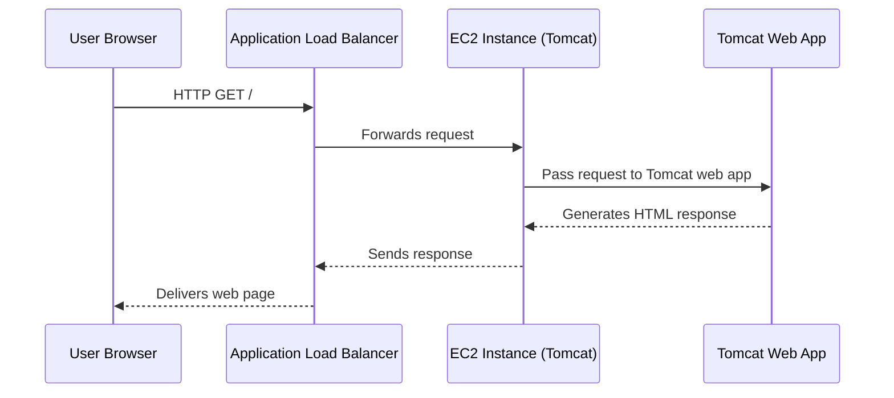

# Lab: Deploying a Web App with AWS Elastic Beanstalk

**Objectives:**
- Prepare and upload your application to S3
- Create and configure an Elastic Beanstalk environment (Tomcat platform)
- Launch and verify the web app
- Explore underlying AWS resources (EC2, ALB, Auto Scaling, Security Group, S3)
- Monitor and update the application


**AWS Elastic Beanstalk**
* AWS Elastic Beanstalk is a platform-as-a-service (PaaS) offering that automates several of the underlying infrastructure tasks, such as capacity provisioning, load balancing, scaling, and monitoring, which are required to run applications on AWS.

Features:
- Simplified Deployment:
   - Automatically manages deployment, capacity, scaling, and health monitoring.
  
- Supported Platforms:
   - Works with Java, .NET, PHP, Node.js, Python, Ruby, Go, and Docker containers.

- Automatic Scaling:
   - It will leverage AWS Auto Scaling and ELB for dynamic resource adjustment.

- Health Monitoring:
   - This provides environmental health insights, performance, and logs.

- Customization:
   - Allows fine-tuning of resources while keeping ease of use.

- Worker Environments:
   - Supports background processing via Amazon SQS.

- AWS Integration:
   - Works seamlessly with EC2, S3, SNS, CloudWatch, Auto Scaling, and ELB.

---

**Architectural Diagram:**

```
+-------------------------------------------------------------+
|                        AWS Cloud                            |
|                                                             |
|  +-------------------+                                      |
|  |   Amazon S3       |  (App Versions)                      |
|  +-------------------+                                      |
|           |                                                 |
|           v                                                 |
|  +-----------------------------+                            |
|  |   Elastic Beanstalk Service |                            |
|  +-----------------------------+                            |
|           |                                                 |
|           v                                                 |
|  +-----------------------------+                            |
|  | Application Load Balancer   |                            |
|  +-----------------------------+                            |
|           |                                                 |
|           v                                                 |
|  +-----------------------------------------------+          |
|  |         Auto Scaling Group                    |          |
|  |   +----------+   +----------+   +----------+  |          |
|  |   |  EC2-1   |   |  EC2-2   |...|  EC2-n   |  |          |
|  |   | (Tomcat) |   | (Tomcat) |   | (Tomcat) |  |          |
|  |   +----------+   +----------+   +----------+  |          |
|  +-----------------------------------------------+          |
|                |                                            |
|         [IAM Role, Security Group]                          |
+-------------------------------------------------------------+

User Browser
   |
   v
[App URL: my-eb-env.elasticbeanstalk.com]
   |
   v
Application Load Balancer → Auto Scaled EC2s (Tomcat)
```
---

**Prepare Your Application Package**

**1. Download a sample Tomcat app:**
   - [tomcat .zip](https://github.com/user-attachments/files/23478832/tomcat.zip)


**2. Create an S3 Bucket (Optional)**

Elastic Beanstalk can manage S3 storage automatically, but you may create a custom bucket for more control.

1. Bucket type → General purpose
2. AWS Console → S3 → **Create bucket**
3. Name: `my-eb-apps-bucket`                           [Must be a unique name]
4. Object Ownership: ACLs disabled (recommended)
5. (For testing only) Uncheck **Block Public Access** and check **I acknowledge..** the warning.
6. Bucket Versioning: Disable
7. Accept other defaults, create the bucket.
8. Click bucket name → **Upload** → **Add files** → select **tomcat.zip** → **Upload**


**3. Create a New Elastic Beanstalk Application**

1. AWS Console → **Elastic Beanstalk**
2. Click **Create Application**
3. Choose **Web server environment**
4. **Application name:** `my-elastic-beanstalk-app21`
5. **Environment name:** `My-elastic-beanstalk-app21-env`
6. **Domain:** Leave blank for autogenerated value                         [or customize, e.g., `techgeek68`]
7. **Platform:** Select `Tomcat` (latest version)
8. **Application code:**  
   - Choose "Upload your code"
   - **Version label:** V1.0
   - Choose **Local file** (upload `tomcat.zip`)                            [or Public S3 URL, e.g., `s3://my-eb-apps-bucket/tomcat.zip`]
9. **Service access:**  
   - Service role: `LabRole`  
   - EC2 instance profile: `LabInstanceProfile`
10. **Instance settings:** (Optional, leave default or adjust as needed)
11. **Database:** None (leave default for this lab)
12. **Instance configuration:**
    - Root volume (boot device): (Leave by default)
    - Auto scaling group → Environment type → Load balanced
       - Min: 2
       - Max: 6
      (default: 2)
    - Instance type: t2.micro and t2.small
    - Load Balancer type Application Load Balancer (default)
13. **Rolling updates, monitoring, logging:** (Leave default or adjust as needed)
    - Email notifications: <Your_Email_Address>
15. **Create** an environment to deploy


**4. Launch and Monitor the Environment**

- Elastic Beanstalk > Environments > My-elastic-beanstalk-app22-env
- Wait several minutes while AWS provisions all resources (EC2, ALB, Auto Scaling, Security Group, S3).
- Health status should display **Ok** on completion.
  


**5. Test and Verify**

1. In the environment dashboard, find **Domain** and click the **environment URL** (ends with `elasticbeanstalk.com`).
2. You should see the sample Tomcat application page.
   


              

**6. Explore Underlying AWS Resources**

- **EC2:** EC2 Dashboard → Instances. You will see two instances named after your environment.


- **Load Balancer:** EC2 → Load Balancers. An Application Load Balancer (ALB) front-ends your environment.
  


  
- **Auto Scaling Group:** EC2 → Auto Scaling Groups. Manages instance scaling.             
- **Security Group:** Allows HTTP (port 80) from anywhere.
- **S3 Bucket:** Stores application version uploads.


**7. Monitor and Manage**

- Elastic Beanstalk → Environment → **Monitoring** tab for metrics (CPU, requests, etc)


  
- Use **Configuration** to adjust scaling, instance type, or environment variables.

  


**8. Update Your Application - Optional**

1. Make code changes locally.
2. Zip and upload a new version:
   - Beanstalk → Environment → **Upload and Deploy**

---

**Sequence Diagram: Web Request Flow**



---

---
